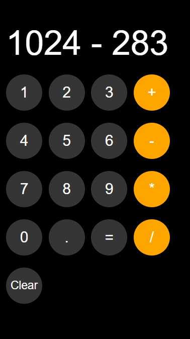

# 🧮 Calculator App

A simple and responsive **Calculator** built with **HTML, CSS, and JavaScript**.  
This calculator allows users to perform basic arithmetic operations with a clean button-based interface, and it saves the current calculation in **localStorage** so progress isn’t lost after refreshing.

---

## 🚀 Features
- ➕ Addition, ➖ Subtraction, ✖️ Multiplication, ➗ Division
- 🟰 Evaluate expressions using `=`
- 🧹 **Clear** button to reset the calculation
- 💾 Persistent state with **localStorage** (calculation is saved across sessions)
- 🖥️ Simple and responsive button layout

---

## 🛠️ Tech Stack
- **HTML5**  
- **CSS3** (custom button styling)  
- **JavaScript (ES6)** — DOM manipulation, event handling, localStorage

---

## 📂 Project Structure
```
calculator-app/
├── index.html
├── calculator.css
├── calculator.js
├── images
    ├── screenshot.png
```
---

## 📸 Preview
<p align="center">
  
</p>

---

## ▶️ Live Demo
Once deployed with GitHub Pages, your app will be available here:  
👉 **https://Krtyaka.github.io/calculator-app/**

---

## ⚡ How to Run Locally
1. Clone this repository:
   ```bash
   git clone https://github.com/Krtyaka/calculator-app.git
